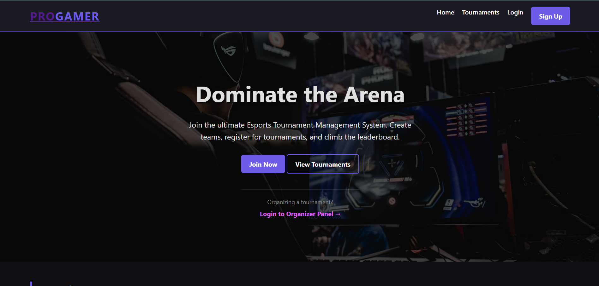
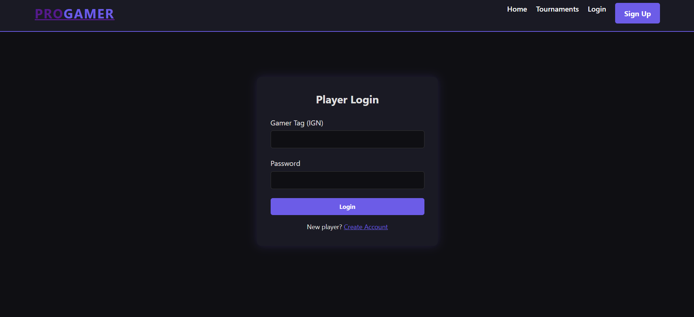
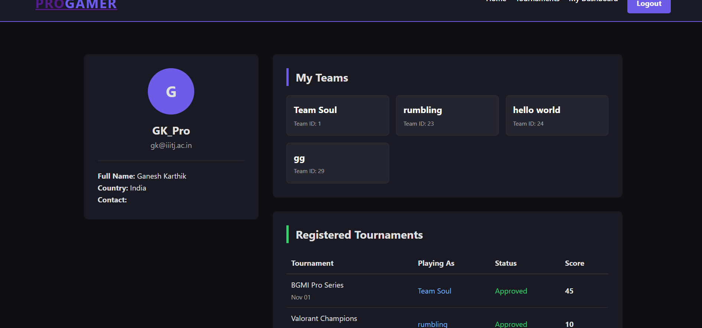
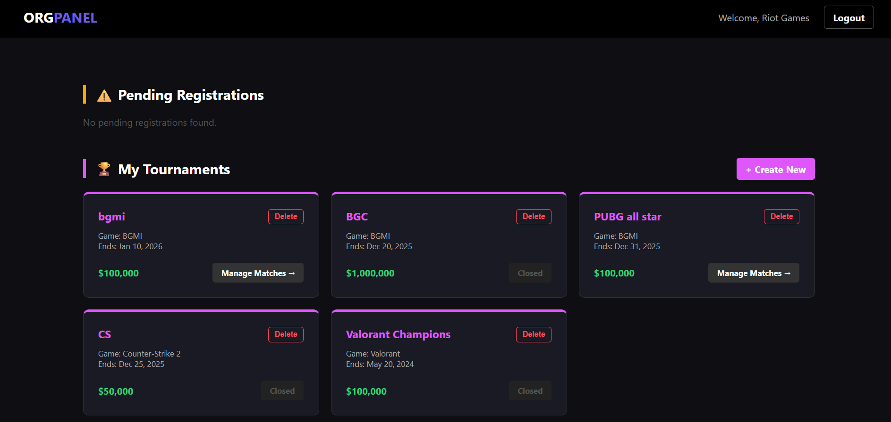
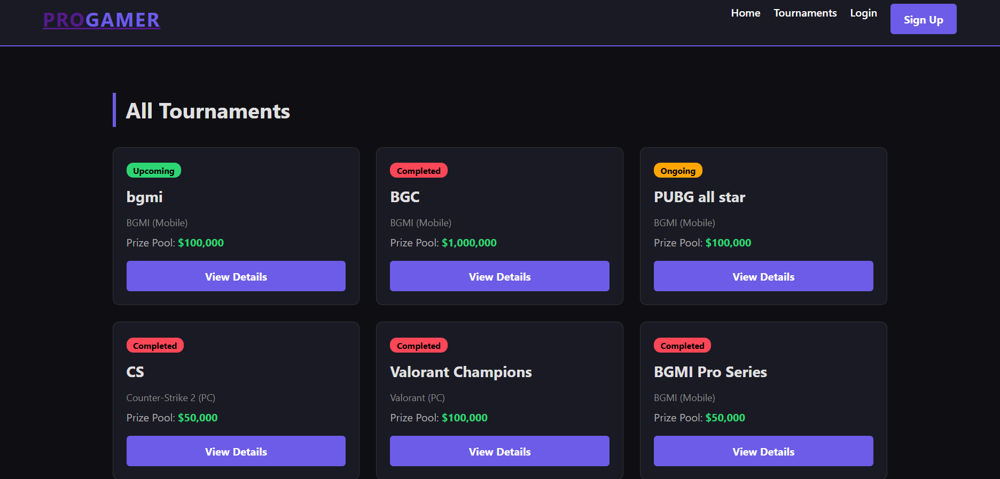
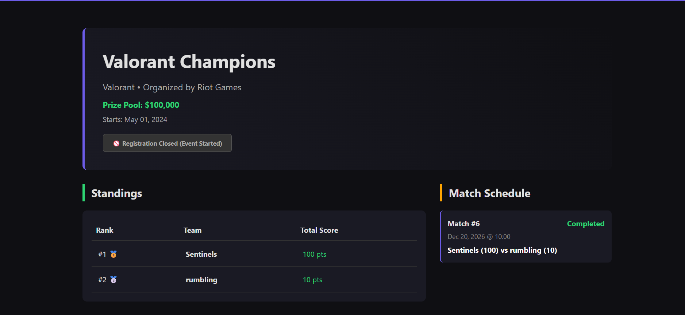

# PHP MySQL Project

A web application built using HTML, CSS, PHP, and MySQL.

## Setup Instructions
1. Clone the repository
2. Start Apache and MySQL (XAMPP / WAMP)
3. Create a database
4. Import `sql/project_db.sql` using phpMyAdmin
5. Copy `config.example.php` to `config.php`
6. Update database credentials
7. Open `index.php` in the browser

## Tech Stack
- HTML
- CSS
- PHP
- MySQL

## Screenshots

### Home Page

### User Login

### User Dashboard

### Organizer Dashboard

### Create Tournament

### Tournament View

## Demo
This project is intended to be run locally using XAMPP/WAMP.
Screenshots of the working application are provided above.

